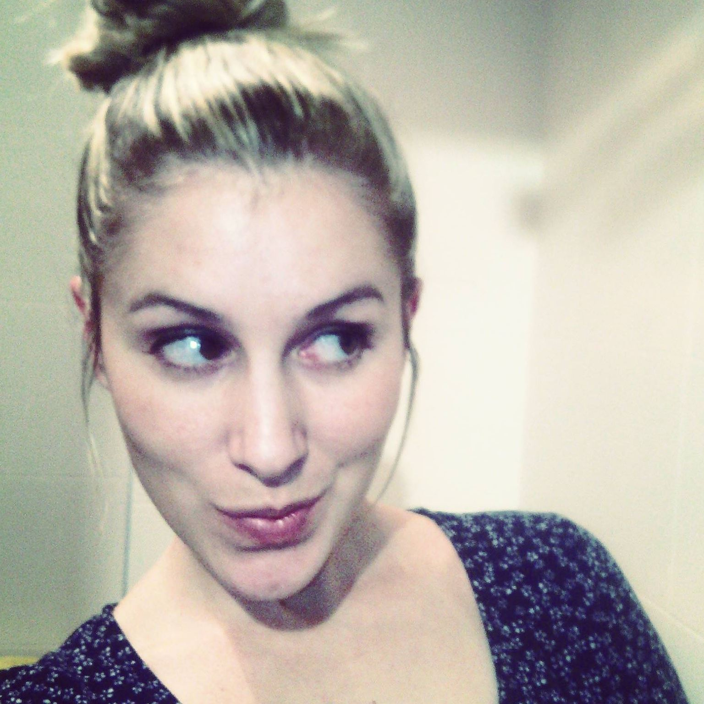
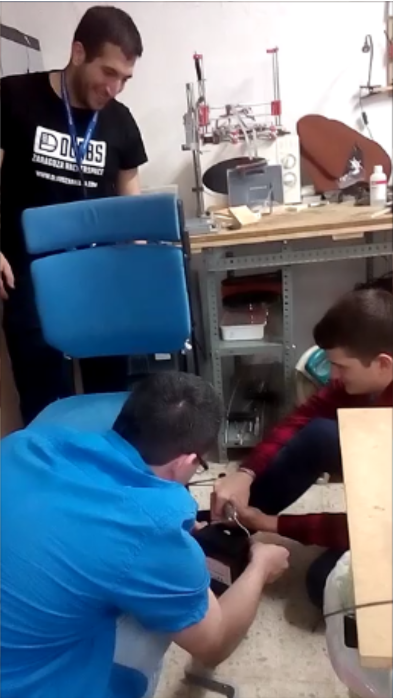
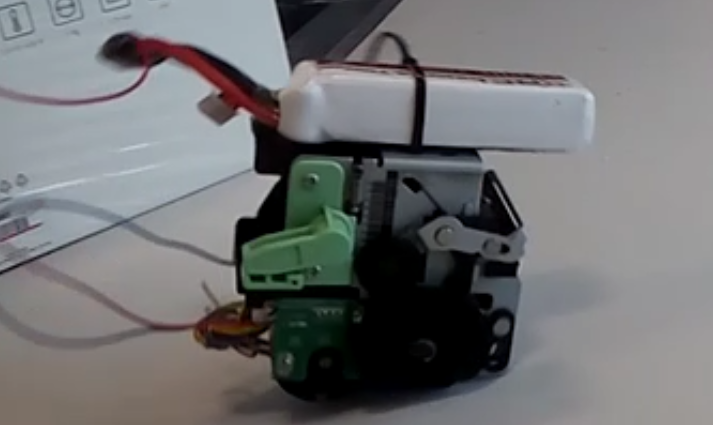

#Team

Our team is divided in two subteams. <b>Hardware</b> and <b>Software</b>, but we enjoy time together.

<h1>Software Team</h1>
At the beginning of the challenge we didn´t know how can we connect every piece. Moreover we needed a powerful PC to work with Oculus and we carry one. But it was neccesary to reinstall every program.

At first, we connect our working devices Leapmotion and Oculus in order to assure that our system can easily 
Software Team work with programming language in C# with Unity.

  
  

  
  
  

Har
<h1>Hardware Team</h1>

  
  
  

<h1>Space Stapler</h1>

  

<h1>SpaceApps Challenge</h1>

  

