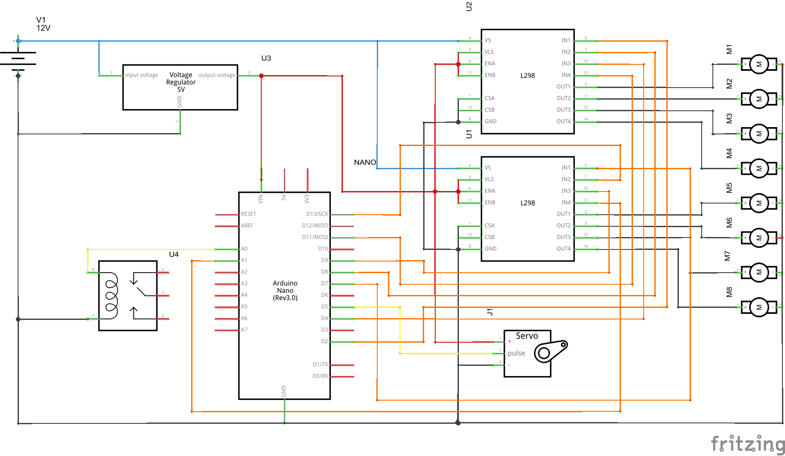

# VR Motion Chair
<b>VR Motion Chair</b> is a hacked office chair to simulate a 3D Virtual environment with a vaiety of movementes controlled with an <b>Arduino Nano</b> Board that is connected with a PC and react with different actions activated by the user on a game.

This chair is just an office chair, a little bit hacked, and designed to give a sensorial response to the user. The chair have seven motors, one servo, and a hacked stapler.

  

 	
The main controller for the VR Motion´s Chair is an Arduino based on <b>ATMEGA_328p</b>, which receive the orders from the main computer throught via serial <b>RS232</b>.
The protocol used is quite simple and scalable. The main computer send the orders based in a configuration that the microcontroller can interpret and act in consequence, and give the most realistic possible sensation.

The seven motors wear a clamp, which change the center of mass of the shaft, changing the rotation movement in a vibration movement, and with controlling the velocity of rotation is possible to control the intensity of vibrations.

The servo acts over a lever, which permit the chair leap back, and at the same moment the electric stapler acts over the pseudo pneumatic system and make the virtual reality chair make the same movements like it was the moon landing.
