# XSpace
<b>XSpace</b> is a project developed in <b>NASA´s SpaceApps Challenge</b>. This project is a VR motion chair with Unity, Oculus, LeapMotion and Arduino.

<b>Xspace</b> is an open source platform that permits to any one to become an astronaut, the project is made from scratch during the space apps. It has an interface human-machine, that permits to the user get into a virtual reality and interacts in the virtual world and have a response in the real world.

<h1>Video - Click on the image </h1> 

 

 

 

 

The virtual reality is a new emerging technology that allows the integration of the human into the new world, with out any limitations.

The system is a combination of software to build the virtual world, and simulating the live off earth and hardware to give to the user more realistic feelings.

To get into the virtual world we use a special goggles used in combination with a system controller that senses your hands moving naturally in <b>3D virtual world</b>, all this information is registered by our solution and give the orders to the pilot chair to make the movements simulating any phase of trip of a spaceship.

This project is solving <a href="https://2016.spaceappschallenge.org/challenges/space-station/launch-a-global-experience"> the Launch: A global experience</a>

<h2>Project: Xspace</h2>

The multimedia resources and the virtual world will give the opportunity to become an astronaut, making the experience of launch, landing, or the life off earth, affordable to every one.

The use of virtual reality will give an absorptive and interactive sensation.
	
The project would like to commemorate one of the most important moments of the space race, the landing on the Moon the <b>20 of July in 1969</b>.

We decided to create a scenario with the <b>Apollo 11</b> at the right moment of moon landing. So finally all  can feel the same as Neil Armstrong, Michael Collins, and Edwin Aldrin.

<ul>
  <li><h4>Challenge:</h4> Our solution is a platform that permits any one become in astronaut, and feel the same as a real astronaut, giving the possibility live any phase at the spaceship,  launch, travel, landing, or any problem that could occur on the off earth trip.
  </li>
  
  <li><h4>Virtual reality:</h4> This system Is an immersive multimedia, using computer technology that could replicate an environment, real or imagined. Virtual reality can create a sensory experience which can include sight, touch, hearing, etc.
  </li>

  <li><h4>Virtual reality headset:</h4> A head-mounted device aim to provide an immersive virtual reality experience, it consist in a stereoscopic head-mounted display, providing separate images for each eye, and head motion tracking , which include gyroscopes, accelerometers, etc...
  </li>
  
  <li><h4>Virtual Hands:</h4> To interact in the virtual world we need our hands get into the virtual world, this is possible with a system which that detect your hands and send the information to our platform.
  </li>
  
  <li><h4>Real response:</h4> The virtual reality it is not enough to give a realistic feelings. One more step is to interact with the virtual world and feel the response over our “pilot chair” in the real world, this is possible thanks to a micro controller that connects your software to the hardware using a change the signals produced by the software into movements over the “pilot chair”
  </li>
</ul>

<h1>Applicatons</h1>

The <b>Xspace</b> platform allow to interact in the virtual world of the trip off earth. The main application in the current challenge is to give a first person experience to every one at the different phases of a space trip. Also this platform could be used in different ways:

<lu>
  <li>To train astronauts, that can feel the same things as on the trip off earth. The scenarios can be changed to put the astronauts in many different situations, with out any real risk, but could give the skill needed in a real trip off earth.</li>
  <li>Could be used to bring the space trips to the most of people that normally can not do it, is easily adaptable to be converted  in a very realistic game, and is a good way to teach the space, and spaceships.</li>
  <li>Entertainment, could be easily transformed in a video game, to put any one to  off earth, and fantastics places, or any invented world</li>
</lu>

<h1>Parts of the project Xspace<h1>

<h3>Software:</h3>

The software used is <b>Unity</b>, that is a cross-platform game engine, which is used to develop video games. The core functionality include rendering for 2D and 3D, physics engines, collision detection, sound, animation, networking, etc. But one of the most important part is the scripting, this permits to the developers create a “game” and interact with it.

<h3>Firmware:</h3> The firmware at the side of the micro controller is the bridge between the main software made with Unity and the actuators. This firmware reside in one <b>arduino board</b>, which  receive the orders and will move the right actuators like, motors, servos, signals, etc.

<h3>Hardware:</h3>

A different kind of hardware were used in this project, like motors, servos, lever, clamps, etc...

<h3>Commercial hardware:</h3>

  <h4>Leap Motion:</h4> This device is a computer hardware that supports hand and fingers motions as inputs, requires no hand contact or touch. Composed by two monochromatic infrared cameras, and three infrared leds.

  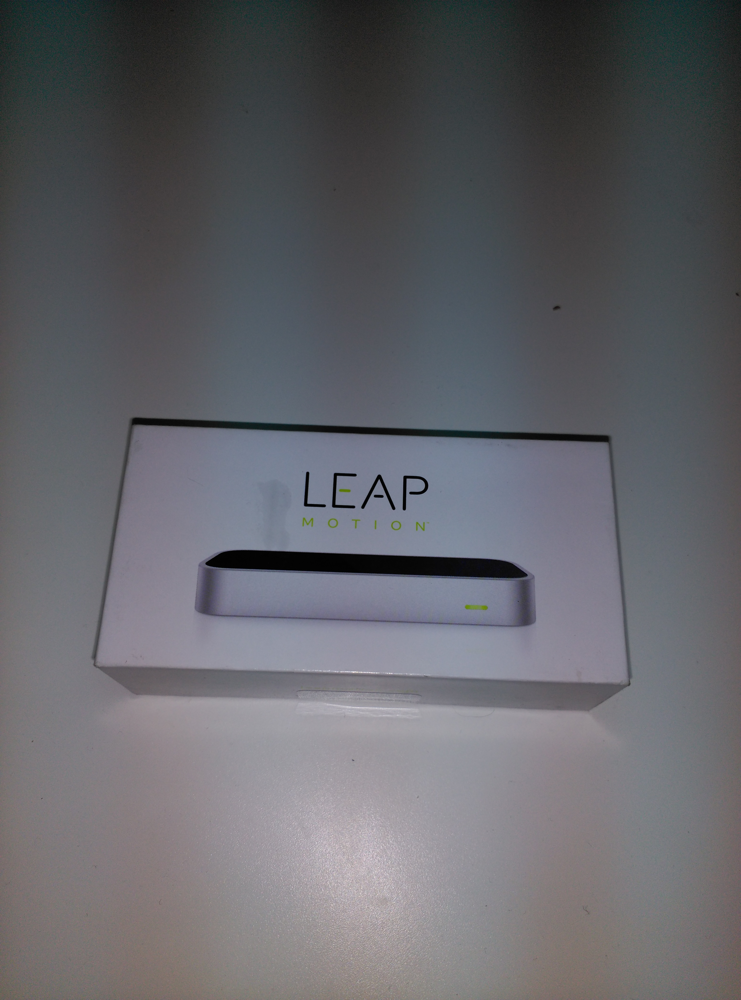

  <h4>Oculus:</h4> This device is the virtual reality headset that permit sight into the virtual world. The Oculus hardware have a stereoscopic vision, gyroscopes, accelerometers, etc...

  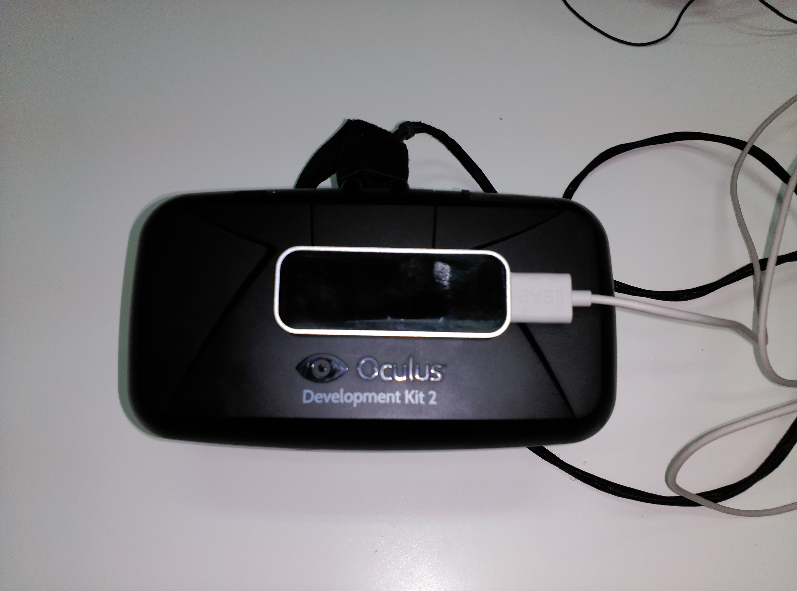

  <h4>Pilot chair:</h4> This is our hardware, hand made, we have recycling material like electric motors, batteries, office chair. The micro controller is an  arduino, with motor drivers, sensors, security stop,  etc...

  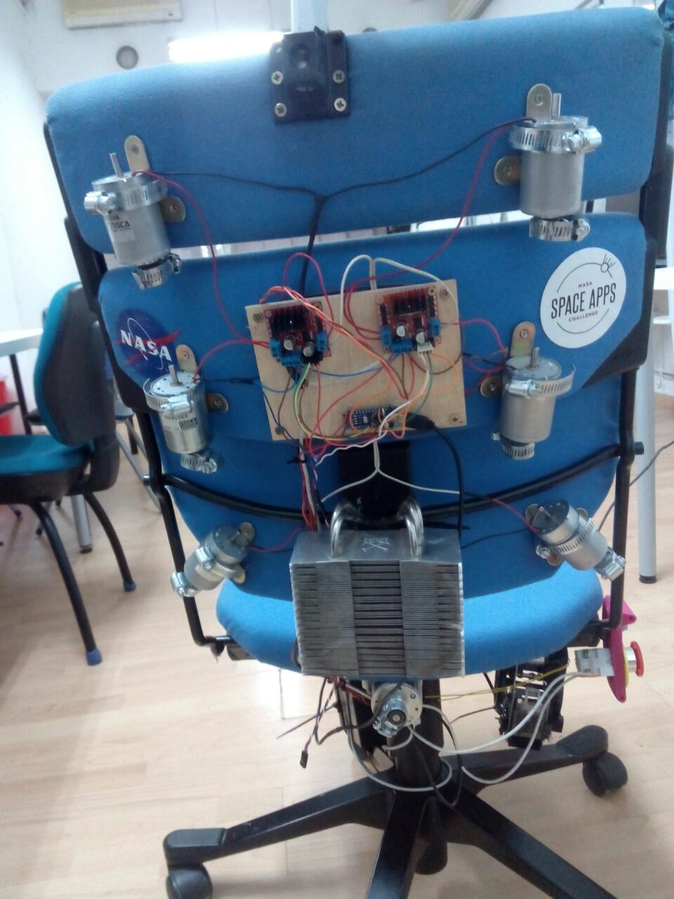
  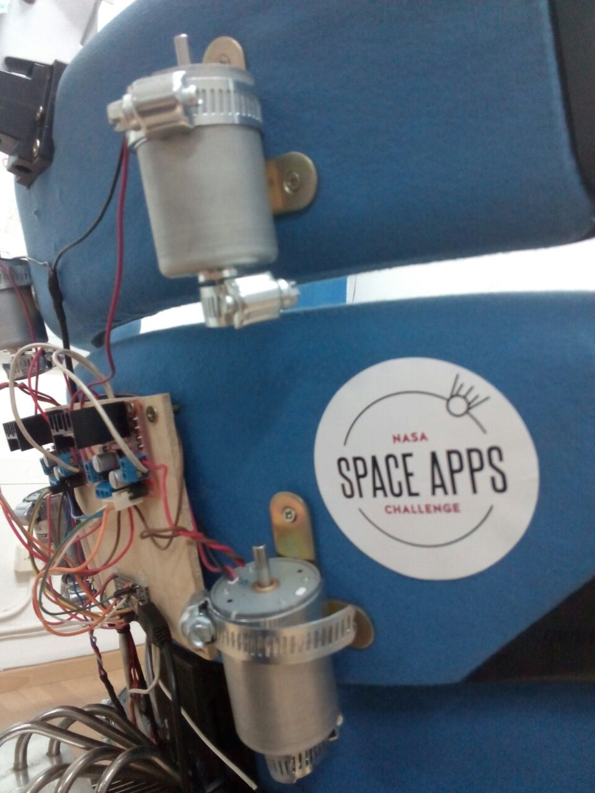
  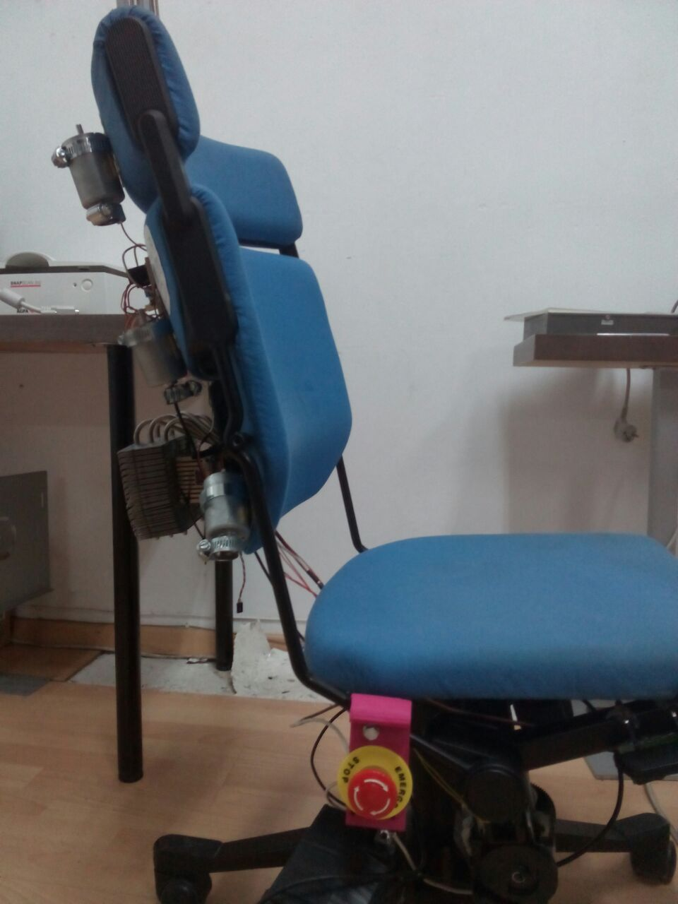
  

<h3>How the project was made</h3>

The project is really a bit complicated, cause include software and hardware, with a very high level of knowledge in video game develop and also a high level of knowledge in electronics to control the actuators with the micro controller.

So the project has to branch  in two different ways. <b>Software and hardware</b>.

<h3>The software</h3>

Even the software was necessary to make some small steps, before to attack the final solution. 

The first approach was to be in the virtual world with a desk and a light and switch the light  in the virtual world, and a light in a real world was switched  too, with this approach were trying to connect the real world and the virtual. This step was a problem bit complicated to solve, cause appears a lot of problems with communications between the video game engine and the micro controller.

Finally overcome this difficulty, and with the right way to connect the video game engine and micro controller, we start to the design the scenario.

The final scenario were selected as the one of the most important moments in the history of the space race, 20 of July of 1969 with the first moon landing.

  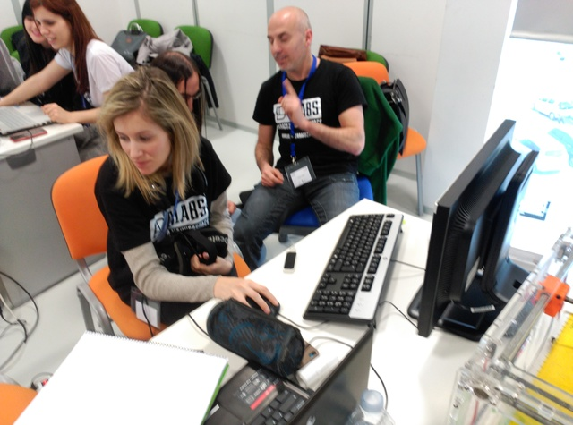
  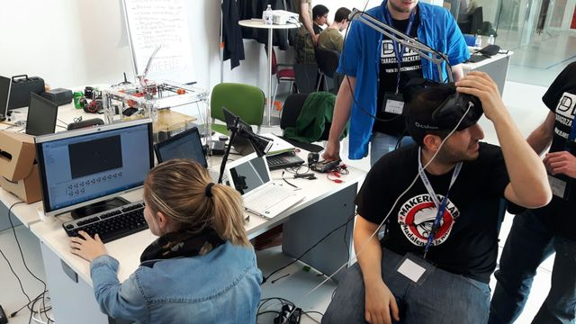
  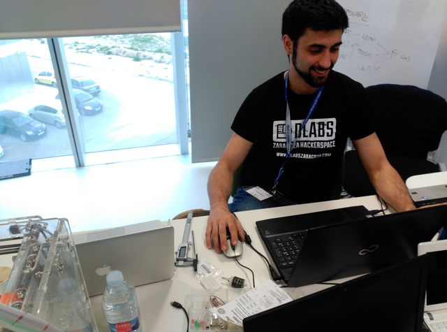

  
<h3>The Firmware</h3>
In electronics systems and computing the firmware is a type of software that provides control over the hardware. 

We worked hard for adapt the signals from the main computer, which is working in the virtual world.

It is necessary a intermediate to translate the acts from the virtual reality to the real world.  This process is lead by the firmware. That converts the orders received into electrical values to the right actuators.
To do this work, we are using an arduino microcontroller, which is connected to the main computer via serial com. The arduino receives the information in a protocol quite simple, but very scalable.

  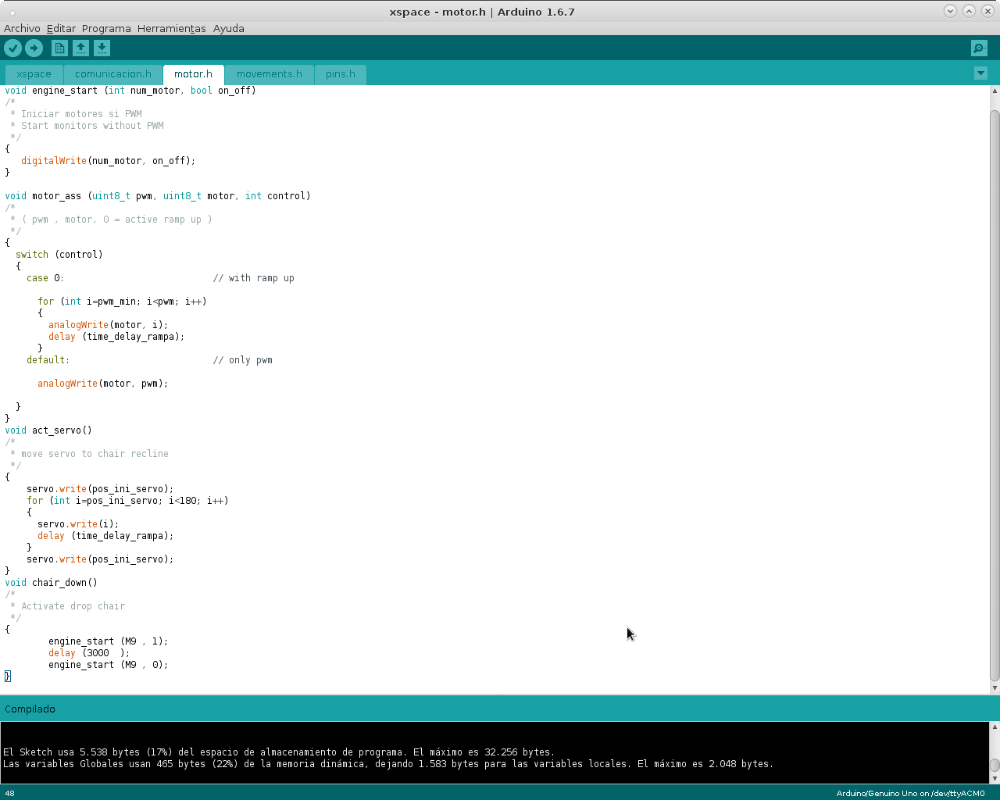
  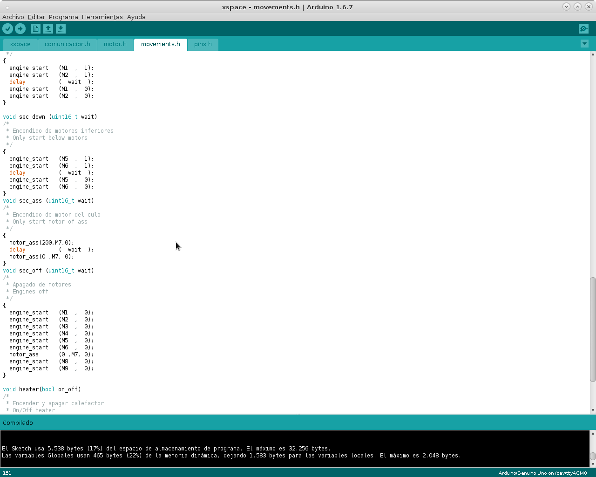

<h3>The hardware</h3>

The hardware was quite difficult to make, cause it was a special holiday 23 of April is our patron Saint and is not possible buy nothing to build a better solution, by the way, we use a lot of recycling materials, like electric motors, office chair.

One of the most common micro controller is the <b>arduino</b> and we use the <b>Nano Version</b>. And we can control till <b>7 motors, one servo, and stapler machine</b>, to actuate over the “pilot chair”.

  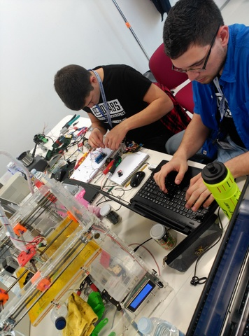
  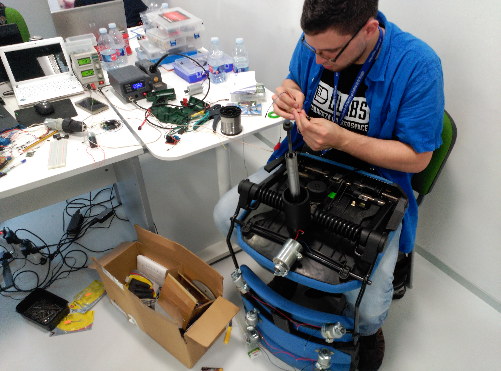
  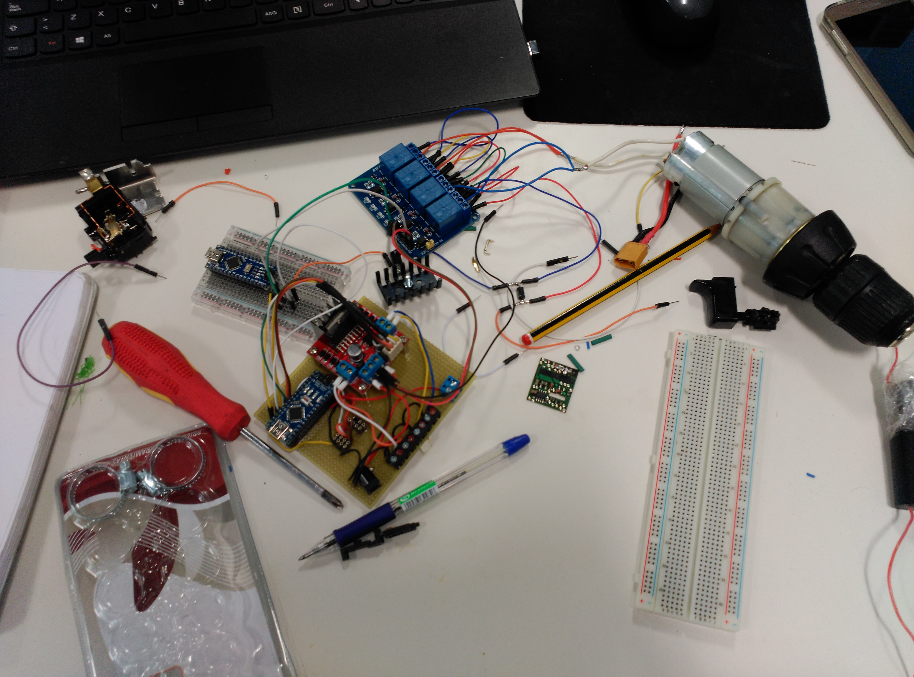

The worse problem was the time to build a “pilot chair” with not to much material, but we find a group of motors recycled from old photocopiers, a batteries, an office chair.

To convert the motor in vibrators we add a clamp to each shaft, making the center of masses is different to the center of movement.

   
   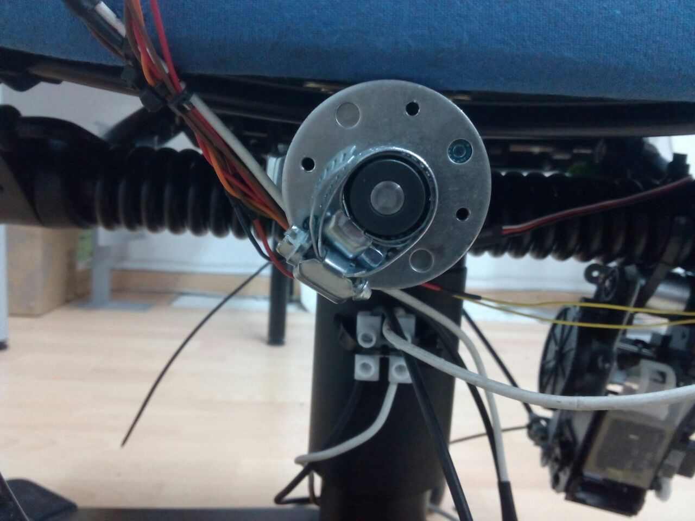
   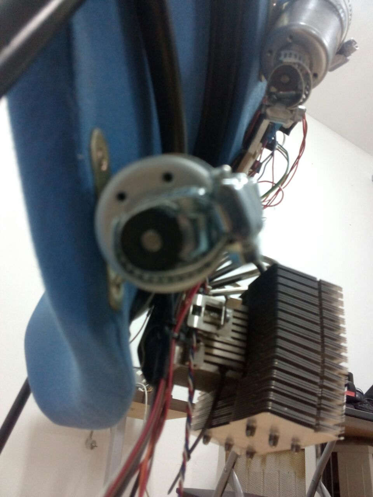

Almost the movements were produced by seven motors with clamps which produce a chair with a lot of vibrations, controlled in intensity by the firmware.

But the chair have two more actuators, one to lean back the chair triggered by a servo. The servo is coupling to the chair using a 3D  piece which trigger a lever and the chair lean back.

The last movement is the chair moving down. The chair has a pseudo pneumatic system when it is triggered the chair goes down simulating the landing moment.

This system is controlled by one stapler machine converted in a machine that pull from the lever and release the air making the chair begin to descend.

  

The <b>Dlabs team</b> is formed by 6 person with a very different skills, from student in electronics to electronic engineers or computing engineers, and all of us with the same passion, to hack  any thing, and learn all the possible related with technology, or science and arts too.

<a href ="https://www.dlabs.co"> Dlabs</a> is a non profit association and our philosophy is to share the new technologies.

