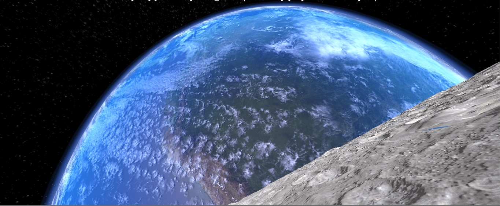
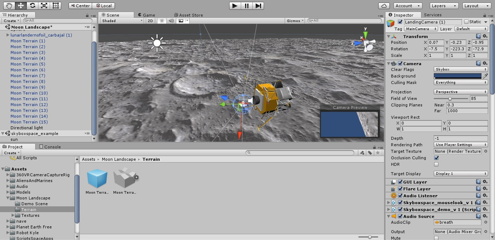
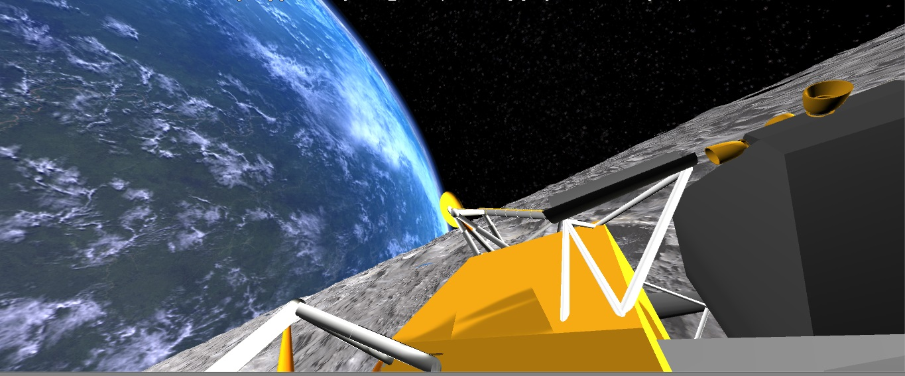

# Unity + Oculus + LeapMotion + Arduino

<b>Software Team</b> have learned a lot with this new experience. This was the first time, that we connect several devices and a graphic engine to gain our purpose.

At the beginning of the challenge we didn´t know how can we connect every piece. Moreover we needed a powerful PC to work with <b>Oculus</b> and we carry one. But it was neccesary to reinstall every program that we used.

At first, we connect our working devices <b>Leapmotion</b> and <b>Oculus</b> in order to assure that our system can easily operate.
We readed a lot of documentation on Saturday to understand how can we stablish a succesful commmunication between the <b>VR Environment</b> and <b>Arduino Nano</b> in order to move our chair actuators.

We readed at first how can we stablish a Serial Port communication with <b>Arduino and Unity</b>. This was the most difficult part, because we obtained some errors with communication port devices, and this case was the key for this project.

Sometimes is better to begin a simple project from scratch, because our errors begin always with copy/paste projects.

<a href="http://www.alanzucconi.com/2015/10/07/how-to-integrate-arduino-with-unity/">Tutorial communication Arduino+Unity</a>

At finnaly we gained communication and provide us some breath to continue.

  

We model our scenario with free unity assets from <b>NASA</b> and we use the lunar module <b>Apollo 11</b> to travel over the moon surface.
<ul>

<li><a href="https://www.assetstore.unity3d.com/en/#!/content/756">NASA Space Flight Assets</a></li>
<li><a href="https://www.assetstore.unity3d.com/en/#!/content/53752">Earth & Planets skyboxes</a></li>
</ul>

Some skyboxes were very useful to obtain more realism on the environment. Moreover we add some audio samples on the game, like astronaut breath, motor noise, and some others. 
This audio assets are on our 

  

Our first idea was transport a person to the <a href="https://www.youtube.com/watch?v=sTBIr65cL_E"><b>moon landing</b> </a> in a 3D environment, and feel like a person was on the suit travelling over it.

The results were succesful enough for 36 hours. How much can we gain if we had more time? <b>We work o it.</b>   :) 

  

  

