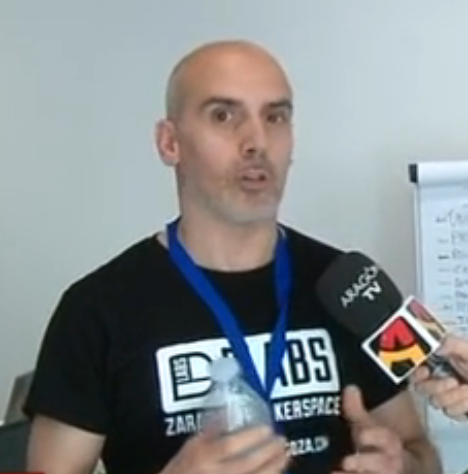
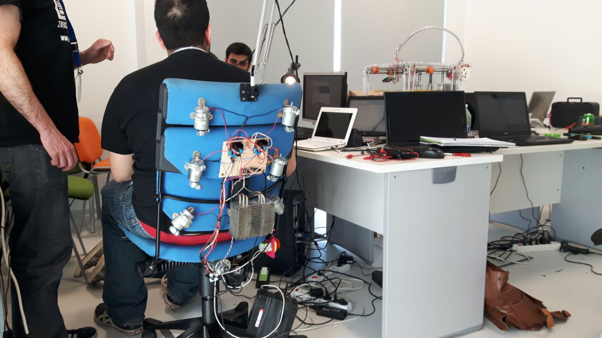
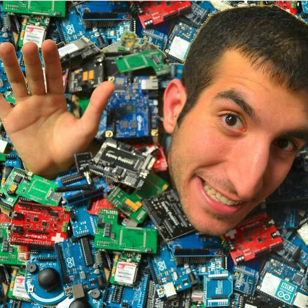

#Team

Our team is divided in two subteams. <b>Hardware</b> and <b>Software</b>, but we enjoy time together.

<h1>Software Team</h1>
At the beginning of the challenge we didn´t know how can we connect every piece. Moreover we needed a powerful PC to work with Oculus and we carry one. But it was neccesary to reinstall every program.

At first, we connect our working devices Leapmotion and Oculus in order to assure that our system can easily operate.
Software Team work with programming language in C# with Unity. We readed a lot of documentation on Saturday to understand how can we stablish a succesful commmunication between the VR Environment and Arduino Nano in order to move our chair actuators.

  
  

  
  
  

Har
<h1>Hardware Team</h1>

  
  

  
  
  

<h1>Space Stapler</h1>

  

<h1>SpaceApps Challenge</h1>
At least we enjoy the victory with some other groups that have worked so much as us. 
This weekend has been a new Xperience for Xspace.

  

